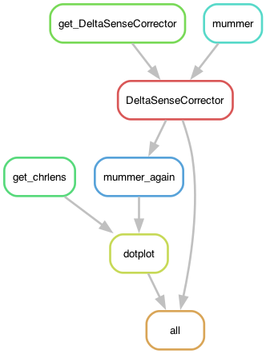
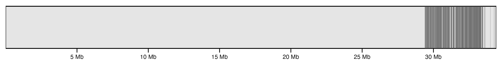
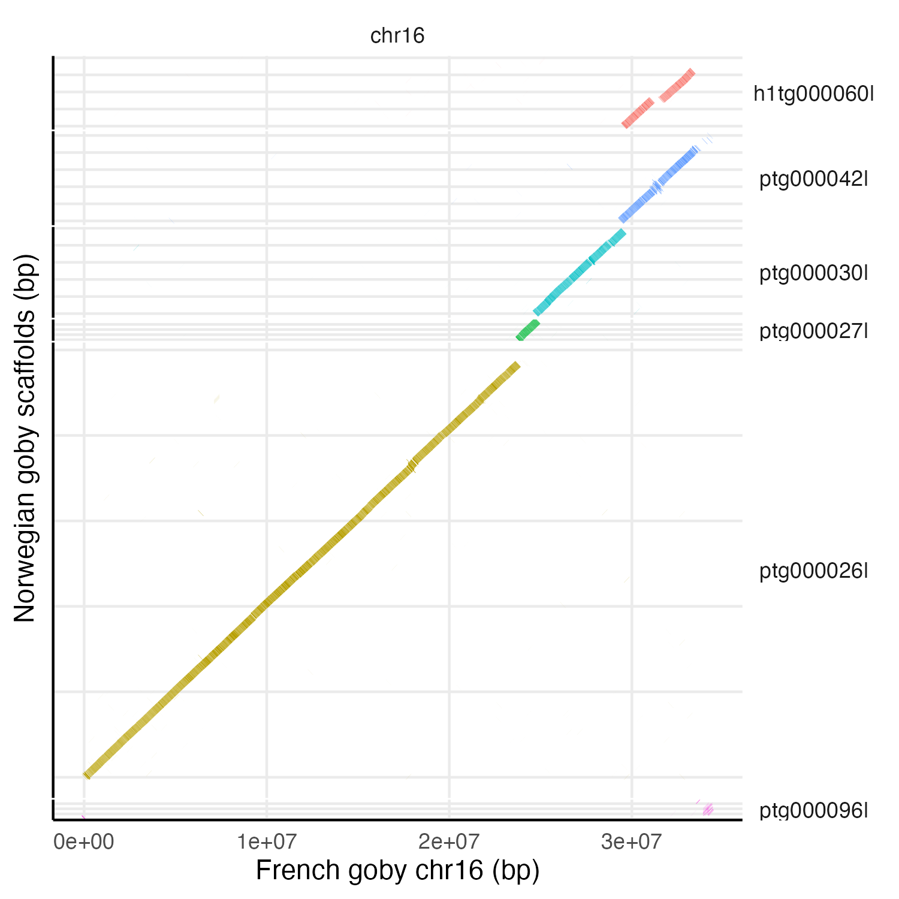
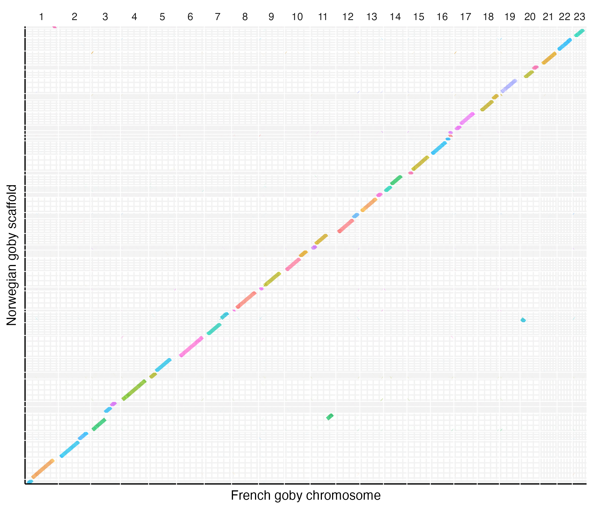

# Goby2Ref: Dotplots between *Pomatoschistus flavescens* assemblies

Comparing our assembly of the two-spotted goby *Pomatoschistus flavescens* to the published chr-level genome assembly from ATLASea (fGobFla1, BioProject PRJEB88435). 

## Building the environment

The pipeline depends on a [conda/mamba](https://mamba.readthedocs.io/en/latest/user_guide/mamba.html) environment.

	$ mamba create -n gobyalign -c conda-forge -c bioconda snakemake-minimal=8.30.0 snakemake-executor-plugin-cluster-generic=1.0.9 biopython=1.85 mummer=3.23

	$ mamba activate gobyalign

The pipeline also uses small mamba environments for individual rules (steps in the analysis), with configuration files in the `envs` folder. The pipeline will automatically install them.

## Input files

The pipeline is designed to take the reference genome `fGobFla1.fasta` and an query assembly that gets "fixed" to match the sense of the chromosomes in the reference. The pipeline then produces an assembly, `PomflaTH1xy.fa` , which is used in the subsequent pipelines. As this file [already exists](), you can just place it in the `results` folder of this repository and the corresponding steps to create it (rules) won't run again, and instead go to subsequent steps.

## The configuration file

The pipeline expects a configuration file in the path `config/config.yaml`, which looks like so:

```yaml
# Reference
reference: "path/to/fGobFla1.fasta" # full path to the reference assembly
nameref: "fGobFla1" # the name of the reference for the output

# Query
query: "path/to/PomflaTH1_XY.fa" # the original assembly but with the hap1 scaffold of the SD region, before flipping the scaffolds to match the reference (not provided in the repository)
namequery: "PomflaTH1xy" # the name of the output assembly after correcting the sense of the scaffolds

# Scripts
dotplot: "scripts/gobydotplot.R"
```

## Using profiles

For this pipeline I use a [profile](https://snakemake.readthedocs.io/en/stable/executing/cli.html#profiles), which has the information necessary to run the pipeline in a SLURM server. It depends on a file called `config.v8+.yaml` that is usually in the `profile` folder.

However, rather than having a profile file in all the pipelines, I declare a global variable with the path to a global configuration file.

	$ export SNAKEMAKE_PROFILE='path/to/profile'

For example, from other pipelines:

	> export SNAKEMAKE_PROFILE='../4_GobyMapping/profile'

The `config.v8+.yaml` file contains:

```yaml
cluster-generic-submit-cmd:
  mkdir -p logs/{rule} &&
  sbatch
    --account={resources.account}
    --partition={resources.partition}
    --cpus-per-task={resources.threads}
    --mem={resources.mem_mb}
    --job-name={rule}
    --error=logs/{rule}/{rule}-{wildcards}-%j.err
    --output=logs/{rule}/{rule}-{wildcards}-%j.out
    --time={resources.time}
    --parsable
default-resources:
  - account="XXXXXXXXX"
  - partition="core"
  - time="1:00:00"
  - threads=1
  - mem_mb=2GB

restart-times: 0
max-jobs-per-second: 10
max-status-checks-per-second: 1
jobs: 100
keep-going: True
rerun-incomplete: True
printshellcmds: True
scheduler: greedy
use-conda: True
cluster-cancel: scancel # To automatically cancel all running jobs when you cancel the main Snakemake process 
cluster-cancel-nargs: 50
```

Where XXXXXXXXX is your cluster account. Replace that! Be also mindful of the name of the partitions used in your cluster and the memory given per thread.

## Pipeline

Go to working directory if you are not there already:

	$ cd 1_Map2Reference

Activate the environment: 

	$ mamba activate gobyalign

First, to get an idea of how the pipeline looks like we can make a rulegraph:

	$ snakemake --snakefile Goby2Ref.smk --rulegraph | dot -Tpng > rulegraph.png



To check that the files for the pipeline are in order:

	$ snakemake --snakefile Goby2Ref.smk -pn

There are many ways of running the pipeline. In this case I'm using the profile file defined above. 

	$ screen -R align
	$ mamba activate gobyalign
	$ export SNAKEMAKE_PROFILE='../4_GobyMapping/profile'
	$ snakemake --snakefile Goby2Ref.smk &> snakemake.log &
	[1] 2879588

For alternative config files

	$ snakemake --snakefile Goby2Ref.smk --configfile config/config_hap2.yaml &> snakemake.log &
	[1] 2035193	

Something went wrong and you want to interrupt the run? Kill it!

	$ kill -s SIGINT -$PID

Where `$PID` is the process ID (in the example above, 2879588 or 2035193).

If the pipeline is ran without declaring the profile path, then tell it to use the conda environments and a number of threads:

	$ snakemake --snakefile Goby2Ref.smk --use-conda -j4 &> snakemake.log &

## Results

The output will be the figures:

- `results/PomflaTH1xy-vs-fGobFla1_chr16_bar.png` - part of Fig. 3 in the paper



- `results/PomflaTH1xy-vs-fGobFla1_Dotplot_chr16.png` - Fig. S5, a dotplot of just chromosome 16



- `results/PomflaTH1xy-vs-fGobFla1_Dotplot.png` - Fig. S2, a dotplot of the full assembly

