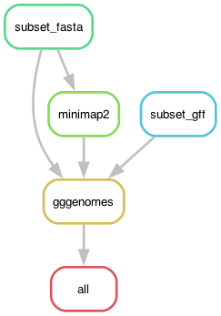

# SDsynteny - Comparing the synteny and annotation of the SD scaffolds in the two-spotted goby

The goal is to compare the male and female version of the sex-determining scaffold in the two-spotted goby *Pomatoschistus flavescens*. The pipeline was designed to run locally on a laptop (tested on a MacOS).

## Building the environment

I built [conda](https://docs.conda.io/en/latest/) environment using the [Mamba](https://mamba.readthedocs.io/en/latest/user_guide/mamba.html) implementation:

	$ mamba create -n gobysynteny -c bioconda -c conda-forge snakemake-minimal=8.30.0 biopython=1.85 blast=2.16.0

	$ mamba activate gobysynteny

In addition, the pipeline uses small environments for the some rules (a subsection of the analysis), with configuration files in the folder `envs`. The pipeline will automatically create the mini environments using these files.

If you wish to run the pipeline in a cluster you might also need to install `snakemake-executor-plugin-cluster-generic=1.0.9` in the environment.

	$ mamba install snakemake-executor-plugin-cluster-generic=1.0.9

## The configuration file

The pipeline expects a configuration file in the path `config/config.yaml`, which looks like so:

```yaml
# Input data
assembly: "path/to/PomflaTH1xy.fa"
satDNAgff: "path/to/PomflaTH1xy-GobyTideCluster_v1.00.gff3"
genegff: "data/TH1_PflaAmhr2y.gff3"

# SD scaffolds
SDscaffolds: ["h1tg000060l", "ptg000042l"]

# Scripts
gggenomes: "scripts/Gggenomes_goby.R"

# Filtering parameters
MINSIZE: 150      # Min length of a hit to survive filtering
EXTRABPSIDE: 50   # Buffer extra base pairs cut next to the start and end of the BLAST hits
VICINITY: 100000   # Max distance between 5 and 3 end hits to form a haplotype 
IDENTITY: 95   # Minimum percentage of identity of BLAST hit to be considered (default 0)
```

## Pipeline

Go to working directory if you are not there already:

	> cd 2_SDsynteny

Activate the environment:

	$ mamba activate gobysynteny

First, to get an idea of how the pipeline looks like we can make a rulegraph:

	$ snakemake --snakefile SDsynteny.smk --rulegraph | dot -Tpng > rulegraph.png



To check that the files for the pipeline are in order:

	$ snakemake --snakefile SDsynteny.smk -pn

Here I am using a profile, but it's location is hard-coded in the snakemake file.


To run the pipeline:

	$ screen -R synteny
	$ mamba activate gobysynteny
	$ snakemake --snakefile SDsynteny.smk --use-conda &> snakemake.log &

You should get a number, `$PID`, that you can use to cancel the job it something goes wrong:

	$ kill -s SIGINT -$PID

## Results

The pipeline will produce part of the Figure 3 in the manuscript. The rest of the figure was put together with some mummer alignment to chromosome 16 and Inkscape.


