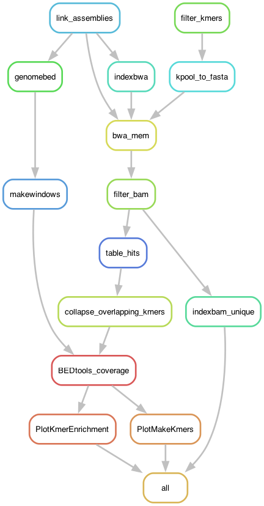

# MaleKmers: Finding male-specific kmers in a Goby genome assembly

Using the haplotype-resolved assemblies of the TH1 individual (two-spotted goby *Pomatoschistus flavescens*), can we find scaffolds enriched for male-associated k-mers? The kmers come from four individuals (two females and two males) sequenced with Illumina technology.

As input the pipeline uses the count table `male_specific.tbl` produced by `kpool merge` from [Kpool](https://github.com/SexGenomicsToolkit/kpool). The specific command is:

	kpool merge -m table.males -f table.females -o male_specific.tbl

And the tables themselves were produced with [Jellyfish](https://www.genome.umd.edu/jellyfish.html) per individual, followed by a `merge` by sex:

	kpool merge -m female1table -f female2table -o rawtable.females"
	kpool merge -m male1table -f male2table -o rawtable.males"

Since the output contains two columns (one per sample), I fused them with awk. For example, for the males:

	awk '{print $1,$2+$3}' rawtable.males > table.males

From the k-mer table, the pipeline generates a fasta file which is then mapped to the given genome assemblies to estimate k-mer coverage in windows.

## Building the environment

I built [conda](https://docs.conda.io/en/latest/) environment using the [Mamba](https://mamba.readthedocs.io/en/latest/user_guide/mamba.html) implementation:

	> mamba create -n gobysmudge -c bioconda snakemake-minimal=8.30.0 snakemake-executor-plugin-cluster-generic=1.0.9 fastk=1.1.0 smudgeplot=0.4.0 bedtools=2.31.1 samtools=1.21

	> mamba activate gobysmudge

In addition, the pipeline uses small environments for the some rules (a subsection of the analysis), with configuration files in the folder `envs`. The pipeline will automatically create the mini environments using these files.

## The configuration file

The pipeline expects a configuration file in the path `config/config.yaml`, which looks like so:

```yaml
## The (heavy) output of kpool merge -m {table.males} -f {table.females} -o male_specific.tbl
malekmers: "path/to/male_specific.tbl"

## Nicknames of the primary, haplotype 1 and haplotype 2 assemblies of TH1
SampleIDs: ["p_ctg", "hap1", "hap2"]

## Assemblies
# In same order as SamplesIDs!
Assemblies: ["pr_171_001_Pomatoschistus_flavescens.hifiasm0.24.0.default.bp.p_ctg.fasta", "pr_171_001_Pomatoschistus_flavescens.hifiasm0.24.0.default.bp.hap1.p_ctg.fasta", "pr_171_001_Pomatoschistus_flavescens.hifiasm0.24.0.default.bp.hap2.p_ctg.fasta"]
path2genomes: "path/to/hifiasm_v0.24.0"

## Scripts
MaleKmers: "scripts/MaleKmers.R"
KmerEnrichment: "scripts/KmerEnrichment.R"
```

## Pipeline

Go to working directory if you are not there already:

	> cd 3_MaleKmers

Activate the environment:

	> mamba activate gobysmudge

First, to get an idea of how the pipeline looks like we can make a rulegraph:

	> snakemake --snakefile MaleKmers.smk --rulegraph | dot -Tpng > rulegraph.png



To check that the files for the pipeline are in order:

	> snakemake --snakefile MaleKmers.smk -pn

Or with the profile in a cluster:

	> snakemake --profile profile -pn

There are many ways of running the pipeline. In this case I'm using the profile file defined above. 

	> screen -R malekmers
	> mamba activate gobysmudge
	> snakemake --profile profile &> snakemake.log &
	[1] 3536441

Or alternatively, without profiles:

	> screen -R malekmers
	> mamba activate gobysmudge
	> snakemake --snakefile MaleKmers.smk -p --cluster "sbatch -A naiss2024-22-1697 -p shared -c {threads} -t {resources.time}" -j 10 --keep-going &> snakemake.log &
	[1] 1702605


## Locally

	% cd /Users/lorena/Library/CloudStorage/Dropbox/VRwork/Analyses/7_Goby/Dardel/complexity_adaptation/04_MaleKmers
	% mamba activate malekmers

	% snakemake --snakefile MaleKmers.smk -pn
	
	% snakemake --snakefile MaleKmers.smk -j8


## Output

The pipeline was originally designed to make a bunch of plots for each input assembly that didn't make it to the paper. I later added the enrichment analysis, which became Figure S7, but it's incorporated as an after thought, so if you remove the two haplotype assemblies from the config file, things won't work.


