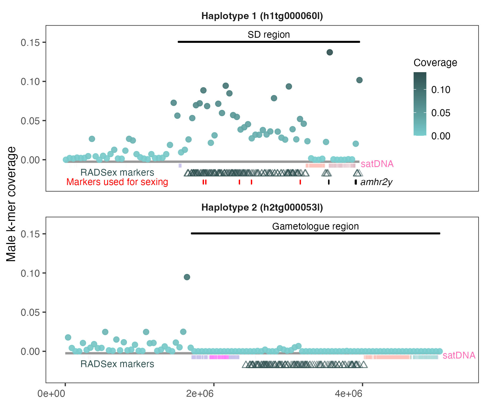

# Plotting the male k-mers

There is no pipeline for this one, just an R script (`scripts/SexLocusVariantsInv.R`) and its input data (most of them in the `data` folder). Please modify the paths in the script as needed to run it.

Two input files, `male_coverage_hap1.txt` and `male_coverage_hap2.txt`, were produced by the `MaleKmers.smk` pipeline and available in `../2_MaleKmers/reports`. Other files were produced with RADsex as described in the paper.

The plot corresponds to the manuscript Figure 4.

