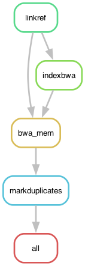

# GobyMapping: Preparing BAM files for variant calling

The goal of this small pipeline is simply to map the Illumina reads of four *Pomatoschistus flavescens* genomes to an input reference genome, either `fGobFla1.fa` (the reference genome available [here](https://www.ncbi.nlm.nih.gov/bioproject/1249779)) or our own assembly of a male fish (TH1, containing only the Y haplotype version of the SD region). 

## Input files

The pipeline takes fastq files that have already been cleaned. The expected path and name of the files is `{path2Illumina}/{sample}/{sample}_postQC.{n}.fq.gz`, where `path2Illumina` is set in the configuration file below, `sample` is the name of each goby individual, and `n` is either 1 or 2 for the two paired-end files.

## Building the environment

For this pipeline I rely on the modules available in my local cluster but they could also be installed using [mamba](https://mamba.readthedocs.io/en/latest/user_guide/mamba.html).

	> module load PDCOLD/23.12 snakemake/8.4.2-cpeGNU-23.12
	> module load bioinfo-tools bwa/0.7.18 samtools/1.20 picard/3.3.0

The pipeline also uses small mamba environments for individual rules (steps in the analysis), with configuration files in the `envs` folder. The pipeline will automatically install them.

## The configuration file

The pipeline expects a configuration file in the path `config/config.yaml`, which looks like so:

```yaml
# Sample IDs
SampleIDs: ["PflaHELAf", "PflaKGBDf", "PflaHELEm", "PflaKGBHm"]
# Illumina reads path
path2Illumina: "path/to/clean/reads"
# The reference genome
REFGenome: "path/to/PomflaTH1y.fa"
# All the Goby Illumina was sequenced in the same lane
flowcell: "B22JLF2LT4"
```

## The profile

For this pipeline I use a [profile](https://snakemake.readthedocs.io/en/stable/executing/cli.html#profiles), which has the information necessary to run the pipeline in a SLURM server. It depends on a file called `config.v8+.yaml` in the `profile` folder.

The config.yaml file contains:

```yaml
snakefile: GobyVariantCalling.smk
executor: cluster-generic

cluster-generic-submit-cmd:
  mkdir -p logs/{rule} &&
  sbatch
    --account={resources.account}
    --partition={resources.partition}
    --cpus-per-task={resources.threads}
    --mem={resources.mem_mb}
    --job-name={rule}
    --error=logs/{rule}/{rule}-{wildcards}-%j.err
    --output=logs/{rule}/{rule}-{wildcards}-%j.out
    --time={resources.time}
    --parsable
default-resources:
  - account="XXXXXXXXX"
  - partition="shared"
  - time="1:00:00"
  - threads=1
  - mem_mb=1770 #The thin nodes have 128 physical cores and 227 available GB, so just 1.77 GB per core

restart-times: 0
max-jobs-per-second: 10
max-status-checks-per-second: 1
jobs: 100
keep-going: True
rerun-incomplete: True
printshellcmds: True
scheduler: greedy
use-conda: True
cluster-cancel: scancel # To automatically cancel all running jobs when you cancel the main Snakemake process 
```

Where XXXXXXXXX is your cluster account. Replace that! Be also mindful of the name of the partitions used in your cluster and the memory given per thread.

You can run the pipeline without the profile (using `--snakefile IntroRegions.smk`), but keep in mind that I designed the rules to call for resources from it. But this can be easily modified if you are a bit familiar with Snakemake.

I also used a configuration file, but that is called internally in the pipeline. It's in the `config` folder.

## Run the Pipeline

Go to working directory if you are not there already:

	> cd 5_GobyMapping

Initiate the environment:

	> module load PDCOLD/23.12 snakemake/8.4.2-cpeGNU-23.12
	> module load bioinfo-tools bwa/0.7.18 samtools/1.20 picard/3.3.0

First, to get an idea of how the pipeline looks like we can make a rulegraph:

	> snakemake --profile profile --rulegraph | dot -Tpng > rulegraph.png



To check that the files for the pipeline are in order:

	> snakemake --profile profile -pn

There are many ways of running the pipeline. In this case I'm using the profile file defined above. 

	> screen -R variants
	> module load PDCOLD/23.12 snakemake/8.4.2-cpeGNU-23.12
	> module load bioinfo-tools bwa/0.7.18 samtools/1.20 picard/3.3.0
	> snakemake --profile profile &> snakemake.log &


In case you don't want to use the profile and run the pipeline instead, it is possible to call it as:

	> snakemake --snakefile GobyMapping.smk -pn
	> snakemake --snakefile GobyMapping.smk --rulegraph | dot -Tpng > rulegraph.png

However, to run it locally the code within the pipeline might have to be adjusted to remove the `resources` directive in all the rules. Once that is done it can be run like:

	> snakemake --snakefile GobyMapping.smk -j4 &> snakemake.log &
	[1] 3794433

Something went wrong and you want to interrupt the run? Kill it!

	$ kill -s SIGINT -$PID

Where `$PID` is the process ID (in the example above, 3794433).

## Results

The output of this pipeline are BAM files used in another pipeline to finish getting variants with GATK. 
