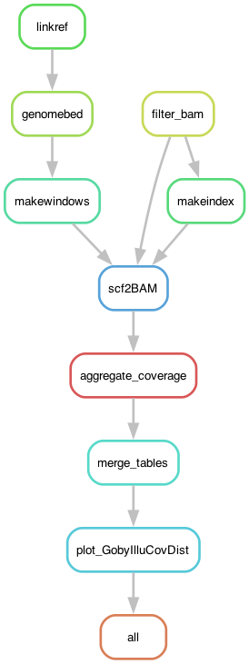

# GobyIlluCoverage: Calculating coverage along the goby's genome

The objective is to infer coverage along the scaffolds of the two-spotted goby *Pomatoschistus flavescens* using Illumina data of four individuals (two females and two males). The focus is on the sex-determining (SD) scaffold. 

## Input files

This pipeline uses the output of `4_GobyMapping` (BAM files), the reference genome and the annotation of satDNA. See the configuration file below.

## The configuration file

The pipeline expects a configuration file in the path `config/config.yaml`, which looks like so:

```yaml
# Sample IDs
SampleIDs: ["PflaHELAf", "PflaKGBDf", "PflaHELEm", "PflaKGBHm"]
# Path to BAM files of Illumina samples mapped to the reference
path2bams: "../4_GobyMapping/mapping"
# The reference genome (absolute path)
REFGenome: "path/to/fGobFla1.fasta"
# satDNA annotation
satDNA: "../data/Annotation/fGobFla1-GobyTideCluster_v1.00.gff3"
# Scripts
GobyIlluCovDist: "scripts/GobyIlluCovDist.R"
```

## Building the environment

For this pipeline I rely on the modules available in my local cluster:

	> module load PDCOLD/23.12 snakemake/8.4.2-cpeGNU-23.12
	> module load bioinfo-tools bwa/0.7.18 samtools/1.20 picard/3.3.0 bedtools/2.31.0

The modules `PDCOLD/23.12` and `bioinfo-tools` are cluster-specific so they can be ignored. But the rest of the packages can be installed with [mamba](https://mamba.readthedocs.io/en/latest/user_guide/mamba.html), which itself is needed to run the pipeline too. That is because the pipeline uses mini environment for each rule (i.e., each step in the pipeline), in particular for using the Pixy program and for plotting. The environments are available in the `envs` folder. 

## The profile

For this pipeline I use a [profile](https://snakemake.readthedocs.io/en/stable/executing/cli.html#profiles), which has the information necessary to run the pipeline in a SLURM server. It depends on a file called `config.v8+.yaml` that is usually in the `profile` folder.

However, rather than having a profile file in all the pipelines, I declare a global variable with the path to a global configuration file.

	> export SNAKEMAKE_PROFILE='path/to/profile'

For example, from other pipelines:

	> export SNAKEMAKE_PROFILE='../4_GobyMapping/profile'

If it doesn't work, you might have to add this to the pipeline at the start of the code, as:

	profilefile: "path/to/profile/config.v8+.yaml"

The `config.v8+.yaml` file contains:

```yaml
cluster-generic-submit-cmd:
  mkdir -p logs/{rule} &&
  sbatch
    --account={resources.account}
    --partition={resources.partition}
    --cpus-per-task={resources.threads}
    --mem={resources.mem_mb}
    --job-name={rule}
    --error=logs/{rule}/{rule}-{wildcards}-%j.err
    --output=logs/{rule}/{rule}-{wildcards}-%j.out
    --time={resources.time}
    --parsable
default-resources:
  - account="XXXXXXXXX"
  - partition="core"
  - time="1:00:00"
  - threads=1
  - mem_mb=2GB

restart-times: 0
max-jobs-per-second: 10
max-status-checks-per-second: 1
jobs: 100
keep-going: True
rerun-incomplete: True
printshellcmds: True
scheduler: greedy
use-conda: True
cluster-cancel: scancel # To automatically cancel all running jobs when you cancel the main Snakemake process 
cluster-cancel-nargs: 50
```

Where XXXXXXXXX is your cluster account. Replace that! Be also mindful of the name of the partitions used in your cluster and the memory given per thread.

## Pipeline

While in the repository directory go into the pipeline folder 

	> cd 6_GobyIlluCoverage

Initiate the environment:

	> module load PDCOLD/23.12 snakemake/8.4.2-cpeGNU-23.12
	> module load bioinfo-tools bwa/0.7.18 samtools/1.20 bedtools/2.31.0

First, to get an idea of how the pipeline looks like we can make a rulegraph:

	> snakemake --snakefile GobyIlluCoverage.smk --rulegraph | dot -Tpng > rulegraph.png



To check that the files for the pipeline are in order:

	> snakemake --snakefile GobyIlluCoverage.smk -pn

or using the profile

	> snakemake --profile profile -pn

There are many ways of running the pipeline. In this case I'm using the profile file defined above. 

	> screen -R cov
	> module load PDCOLD/23.12 snakemake/8.4.2-cpeGNU-23.12
	> module load bioinfo-tools bwa/0.7.18 samtools/1.20 bedtools/2.31.0
	> export SNAKEMAKE_PROFILE='path/to/profile'
	> snakemake --snakefile GobyIlluCoverage.smk &> snakemake.log &
	[1] 564694

## Results

The output will be two figures:

- `results/Coverage_density_chrs.png` -- The distribution of coverage across samples and chromosomes
- `results/Coverage_scan_chrs.png` -- Equivalent to Figure S8 illustrating the normalized coverage of the four individuals sequenced with Illumina along selected chromosomes of fGobFla1. 
