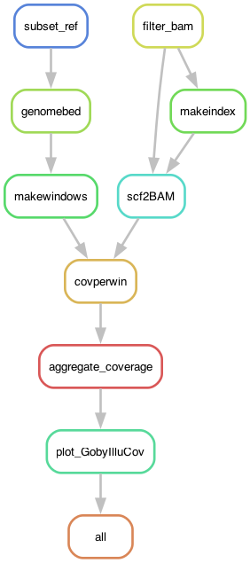

# GobyMaleCoverage: Calculating coverage along the goby's genome

The objective is to infer coverage along the Y haplotype of the two-spotted goby *Pomatoschistus flavescens* using Illumina data of four individuals (two females and two males). This pipeline is very similar to the one in `5_GobyIlluCoverage` but it focuses in just in the Y scaffold, while the previous pipeline deals with all scaffolds at some point.

## Input files

This pipeline uses the output of `4_GobyMapping` (BAM files) but ran for `PomflaTH1xy.fa` **with the x haplotype removed** (let's call it `PomflaTH1y.fa`), the reference genome (you can use the original `PomflaTH1xy.fa` or `PomflaTH1y.fa`, it won't make a difference), the annotation of satDNA, and the annotation of the *amhr2y* gene in gff3 format. See the configuration file below.

If you ran the pipeline in `4_GobyMapping` you will have to copy the empty folder again and run it this time for `PomflaTH1y.fa`. To remove the x scaffold you can use my script [purgeFasta.py](https://github.com/SLAment/Genomics/blob/master/FastaManipulation/purgeFasta.py):

	% python purgeFasta.py PomflaTH1xy.fa "ptg000042l" --string --purge > PomflaTH1y.fa

## The configuration file

The pipeline expects a configuration file in the path `config/config.yaml`, which looks like so:

```yaml
# Sample IDs
ampleIDs: ["PflaHELAf", "PflaKGBDf", "PflaHELEm", "PflaKGBHm"]
# Path to BAM files of Illumina samples mapped to the reference
path2BAMs: "../4_GobyMapping/mapping"
# The reference genome (absolute path)
REFGenome: "../../Dryad/Assembly/PomflaTH1xy.fa"
# Focal scaffold to calculate coverage
focalscf: "h1tg000060l"
# Gene Annotation
genegff: "../data/Annotation/TH1_PflaAmhr2y.gff3"
# satDNA annotation
satDNA: "../data/Annotation/PomflaTH1xy-GobyTideCluster_v1.00.gff3"

# Window size
WINSIZE: 5000

# Scripts
GobyIlluCov: "scripts/GobyIlluCovMale.R"
SDstart: 1512182 # To set the start in the X axis of the final plot
```

## Building the environment

The pipeline depends on a [conda/mamba](https://mamba.readthedocs.io/en/latest/user_guide/mamba.html) environment.

	> mamba create -n malecov -c bioconda snakemake-minimal=9.13.3 snakemake-executor-plugin-cluster-generic=1.0.9 biopython=1.85 bedtools=2.31.0 samtools=1.20 numpy=2.3.3

	> mamba activate malecov

The pipeline also uses small mamba environments for individual rules (steps in the analysis), with configuration files in the `envs` folder. The pipeline will automatically install them.

## The profile

For this pipeline I use a [profile](https://snakemake.readthedocs.io/en/stable/executing/cli.html#profiles), which has the information necessary to run the pipeline in a SLURM server. It depends on a file called `config.v8+.yaml` that is usually in the `profile` folder.

However, rather than having a profile file in all the pipelines, I declare a global variable with the path to a global configuration file.

	> export SNAKEMAKE_PROFILE='path/to/profile'

For example, from other pipelines:

	> export SNAKEMAKE_PROFILE='../4_GobyMapping/profile'

If it doesn't work, you might have to add this to the pipeline at the start of the code, as:

	profilefile: "path/to/profile/config.v8+.yaml"

The `config.v8+.yaml` file contains:

```yaml
cluster-generic-submit-cmd:
  mkdir -p logs/{rule} &&
  sbatch
    --account={resources.account}
    --partition={resources.partition}
    --cpus-per-task={resources.threads}
    --mem={resources.mem_mb}
    --job-name={rule}
    --error=logs/{rule}/{rule}-{wildcards}-%j.err
    --output=logs/{rule}/{rule}-{wildcards}-%j.out
    --time={resources.time}
    --parsable
default-resources:
  - account="XXXXXXXXX"
  - partition="core"
  - time="1:00:00"
  - threads=1
  - mem_mb=2GB

restart-times: 0
max-jobs-per-second: 10
max-status-checks-per-second: 1
jobs: 100
keep-going: True
rerun-incomplete: True
printshellcmds: True
scheduler: greedy
use-conda: True
cluster-cancel: scancel # To automatically cancel all running jobs when you cancel the main Snakemake process 
cluster-cancel-nargs: 50
```

Where XXXXXXXXX is your cluster account. Replace that! Be also mindful of the name of the partitions used in your cluster and the memory given per thread.

## Pipeline

Go to working directory if you are not there already:

	> cd 7_GobyMaleCoverage

First, to get an idea of how the pipeline looks like we can make a rulegraph:

	> snakemake --snakefile GobyMaleCoverage.smk --rulegraph | dot -Tpng > rulegraph.png



To check that the files for the pipeline are in order:

	> snakemake --snakefile GobyMaleCoverage.smk -pn

or using the profile

	> snakemake --profile profile -pn

There are many ways of running the pipeline. In this case I'm using the profile file defined above. 

	> screen -R malecov
	> mamba activate malecov
	> export SNAKEMAKE_PROFILE='path/to/profile'
	> snakemake --snakefile GobyMaleCoverage.smk &> snakemake.log &
	[1] 2493219

## Results

The pipeline will produce a single figure:

- `h1tg000060l_covwin5kb_coverage_scan.png` or a similar name depending on the parameters in the `config.yaml` file. Equivalent to Figure S9 illustrating the normalized coverage of four individuals sequenced with Illumina along the SD region (Y haplotype). 

