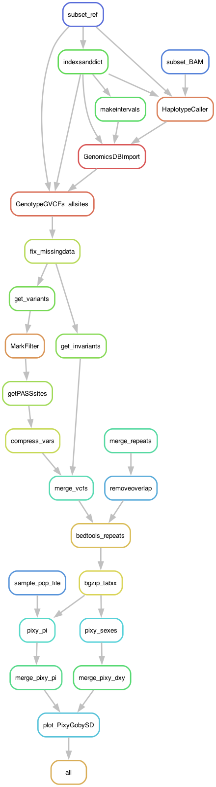
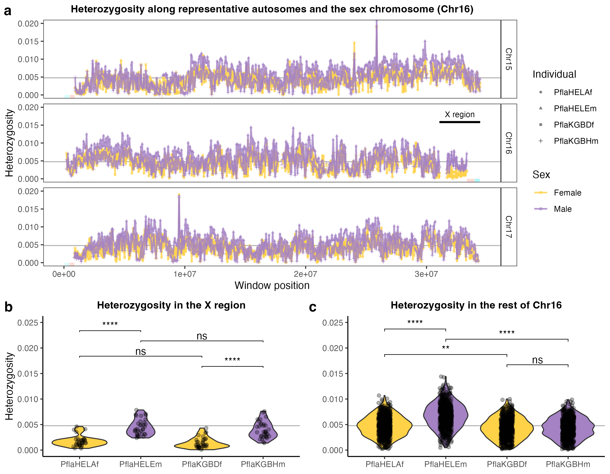

# GobyMaleVariant: Calling variants on the goby sex-determining scaffold to estimate heterozygosity

Variant calling can be very computationally demanding and the "all-sites" vcf files are quite heavy. Hence I restricted this pipeline to just 3 chromosomes, including chr16 that contains the SD region. The goal is to calculate heterozygosity (or nucleotide diversity per individual) for our four two-spotted goby *Pomatoschistus flavescens* individuals, two females and two males. The hope was to find that females are more homozygous than males, which is true, but we also found that the differentiation between the SD region and the rest of the chromosome and other chromosomes is non-existant.

## Input files

This pipeline uses the BAM files produced by the pipeline in `5_GobyIlluCoverage` ran for the `fGobFla1.fasta` reference genome, the reference itself, the repeats annotation (two files: TEs and satDNA). The pipeline also uses a small `data/popfile.txt` file to mark who is male and who is female. The BAM files have been filtered to removed double-mapping reads (leaving one, removing the other). 

The pipeline runs for a window size of of 50000 bp, but this can be changed in the `config/config.yaml` file below.

## The configuration file

The pipeline expects a configuration file in the path `config/config.yaml`, which looks like so:

```yaml
# Sample IDs
SampleIDs: ["PflaHELAf", "PflaKGBDf", "PflaHELEm", "PflaKGBHm"]
# Illumina reads path
path2BAMs:  "../5_GobyIlluCoverage/mapping" # there should be a folder per sample, and inside a BAM file called "{sample}.sorted.debup.filtered.bam"
# The reference genome (absolute path)
REFGenome: "path/to/fGobFla1.fasta"
# The focal scaffold names
targetscfs: ["OZ251424", "OZ251425", "OZ251426"]
# SD scaffold
SDscfs: ["OZ251425"]
# satDNA gff
satDNA: "../data/Annotation/fGobFla1-GobyTideCluster_v1.00.gff3"
# TE gff
TEgff: "../data/Annotation/fGobFla1-GobyTEv1.00.gff3"
# Population file (a headerless, tab-separated file)
popfile: "data/popfile.txt"
# Pixy window size
WINSIZE: 50000
# Ploting script
PixyGobySD: "scripts/PixyGobySDFrench.R"
```

## Building the environment

For this pipeline I rely on the modules available in my local cluster:

	> module load PDCOLD/23.12 snakemake/8.4.2-cpeGNU-23.12 biopython/1.84-cpeGNU-23.12
	> module load bioinfo-tools samtools/1.20 gatk/4.5.0.0 picard/3.3.0 bedtools/2.31.0 bcftools/1.20 vcftools/0.1.16 bedtools/2.31.0

The modules `PDCOLD/23.12` and `bioinfo-tools` are cluster-specific so they can be ignored. But the rest of the packages can be installed with [mamba](https://mamba.readthedocs.io/en/latest/user_guide/mamba.html), which itself is needed to run the pipeline too. That is because the pipeline uses mini environment for each rule (i.e., each step in the pipeline), in particular for using the Pixy program and for plotting. The environments are available in the `envs` folder. 

While running the pipeline in my cluster, Snakemake had issues using the pixy environment, for some reason I never figured out. The solution was to create the mini environment before hand and tell the pipeline to run that instead of installing its own. To make it do:

	> mamba create -n pixyenv conda-forge::pixy=2.0.0.beta6

The pipeline is hardcoded to expect this `pixyenv` environment to exist and it will activate it internally (no need to activate it yourself).

## The profile

For this pipeline I use a [profile](https://snakemake.readthedocs.io/en/stable/executing/cli.html#profiles), which has the information necessary to run the pipeline in a SLURM server. It depends on a file called `config.v8+.yaml` that is usually in the `profile` folder.

However, rather than having a profile file in all the pipelines, I declare a global variable with the path to a global configuration file.

	> export SNAKEMAKE_PROFILE='path/to/profile'

For example, from other pipelines:

	> export SNAKEMAKE_PROFILE='../4_GobyMapping/profile'

If it doesn't work, you might have to add this to the pipeline at the start of the code, as:

	profilefile: "path/to/profile/config.v8+.yaml"

The `config.v8+.yaml` file contains:

```yaml
cluster-generic-submit-cmd:
  mkdir -p logs/{rule} &&
  sbatch
    --account={resources.account}
    --partition={resources.partition}
    --cpus-per-task={resources.threads}
    --mem={resources.mem_mb}
    --job-name={rule}
    --error=logs/{rule}/{rule}-{wildcards}-%j.err
    --output=logs/{rule}/{rule}-{wildcards}-%j.out
    --time={resources.time}
    --parsable
default-resources:
  - account="XXXXXXXXX"
  - partition="core"
  - time="1:00:00"
  - threads=1
  - mem_mb=2GB

restart-times: 0
max-jobs-per-second: 10
max-status-checks-per-second: 1
jobs: 100
keep-going: True
rerun-incomplete: True
printshellcmds: True
scheduler: greedy
use-conda: True
cluster-cancel: scancel # To automatically cancel all running jobs when you cancel the main Snakemake process 
cluster-cancel-nargs: 50
```

Where XXXXXXXXX is your cluster account. Replace that! Be also mindful of the name of the partitions used in your cluster and the memory given per thread.

## Pipeline

Go to working directory if you are not there already:

	> cd 8_GobyMaleVariant

Initiate the environment:

	> module load PDCOLD/23.12 snakemake/8.4.2-cpeGNU-23.12 biopython/1.84-cpeGNU-23.12
	> module load bioinfo-tools samtools/1.20 gatk/4.5.0.0 picard/3.3.0 bedtools/2.31.0 bcftools/1.20 vcftools/0.1.16 bedtools/2.31.0
	> export SNAKEMAKE_PROFILE='path/to/profile'

First, to get an idea of how the pipeline looks like we can make a rulegraph:

	> snakemake --snakefile GobyMaleVariant.smk --rulegraph | dot -Tpng > rulegraph.png



To check that the files for the pipeline are in order:

	> snakemake --snakefile GobyMaleVariant.smk -pn

There are many ways of running the pipeline. In this case I'm using the profile file defined above. 

	> screen -R malesnps
	> module load PDCOLD/23.12 snakemake/8.4.2-cpeGNU-23.12 biopython/1.84-cpeGNU-23.12
	> module load bioinfo-tools samtools/1.20 gatk/4.5.0.0 picard/3.3.0 bedtools/2.31.0 bcftools/1.20 vcftools/0.1.16 bedtools/2.31.0
	> export SNAKEMAKE_PROFILE='path/to/profile'
	> snakemake --snakefile GobyMaleVariant.smk &> snakemake.log &
	[1] 3794433

Something went wrong and you want to interrupt the run? Kill it!

	$ kill -s SIGINT -$PID

Where `$PID` is the process ID (in the example above, 3794433).

## Results

The output will be two figures:

- `results/Fig5_Heterozygosity_SDscf.png` -- The Figure 5 in the paper, showcasing heterozygosity in the four individuals along the chromosomes, and violin plots for the SD region and the rest of chromosome 16.



- `results/Divergence_SDscf.pdf` -- The distribution of divergence (calculated as dxy) between females and males. It wasn't as helpful so it didn't make it to the paper.


