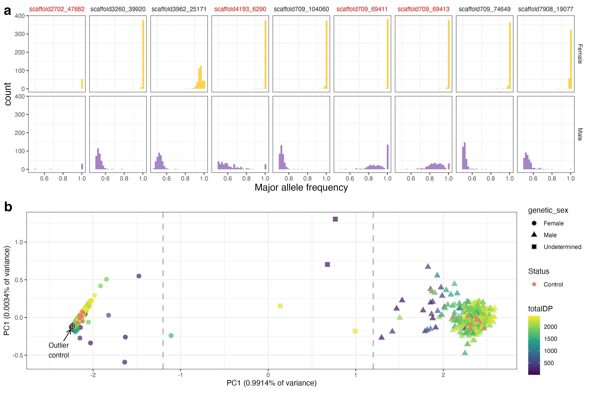
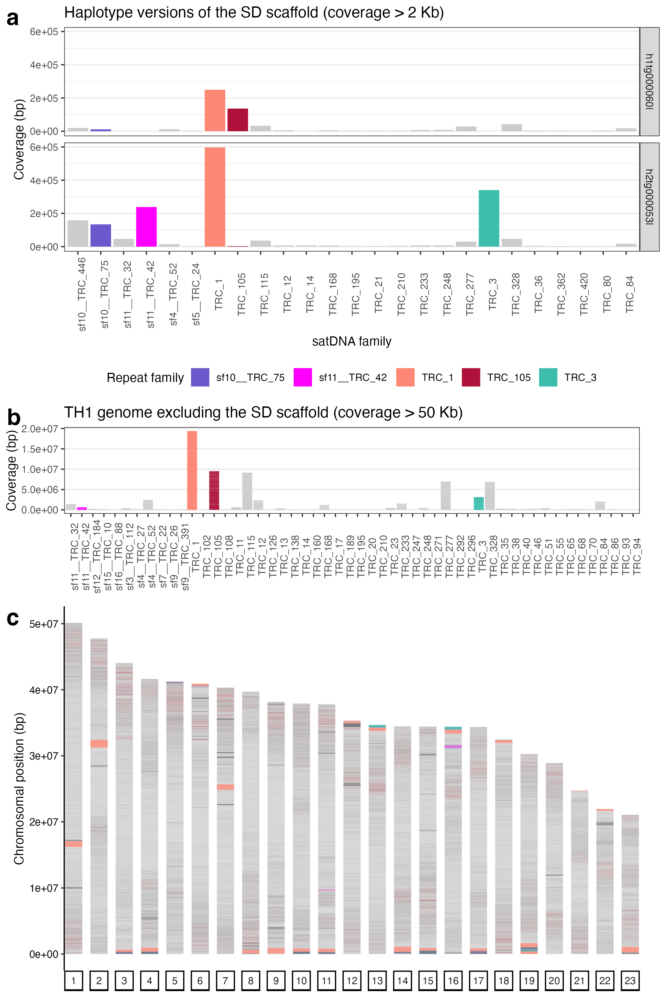

# Other pipelines

Here you'll find code for smaller analyses that didn't have a dedicated pipeline. The two scripts set the input files manually, so make sure you change the paths to match your computer! 

See the paper for details on the figures.

- Figure S1:  Design of sex-specific markers for the two-spotted goby.

- Figure S6: Abundance of TideCluster satDNA families in the P. flavescens genome

